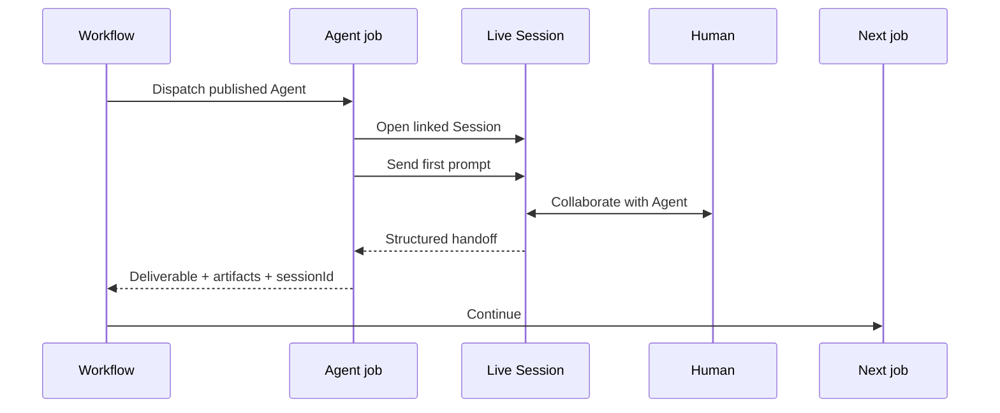

# Interactive Sessions: Workflow Integration

Interactive Sessions can become durable human-collaboration points inside a Xema Workflow. The integration uses the standard `xema/agent@2.1.0` action with `agentSession: true`; there is no separate Session action and no separate Agent profile.

## Operating sequence

1. The Workflow reaches an Agent job.
2. Xema resolves the published `agentRef`, including its Skills, tools, sub-agents, model policy, and workspace composition.
3. With `agentSession: true`, Xema opens a workflow-linked Session and sends `agentContext.prompt` as its first turn.
4. People and the Agent collaborate through the Session while the Workflow remains durable.
5. The Session produces a structured handoff.
6. That handoff becomes the Agent job's output and downstream jobs continue.



## Complete pattern

```yaml
apiVersion: xema.dev/workflow/v1alpha1
kind: Workflow
metadata:
  name: governed-exception-resolution
  version: 1.0.0

on:
  workflow_dispatch:
    inputs:
      caseId:
        type: string
        required: true

jobs:
  prepare:
    uses: xema/agent@2.1.0
    with:
      agentRef: case-analyst@3
      deliverableSpecRef: case-brief@2
      agentContext:
        prompt: Assemble the evidence and unresolved questions.
        caseId: ${{ inputs.caseId }}
    outputs:
      brief: ${{ job.outputs.structuredOutput }}

  collaborate:
    needs: [prepare]
    uses: xema/agent@2.1.0
    timeout: 24h
    with:
      agentRef: operations-coordinator@5
      deliverableSpecRef: exception-resolution@2
      agentContext:
        prompt: Review the case with the operator and produce the agreed resolution.
        caseId: ${{ inputs.caseId }}
        brief: ${{ needs.prepare.outputs.brief }}
      agentSession: true
    outputs:
      sessionId: ${{ job.outputs.sessionId }}
      resolution: ${{ job.outputs.structuredOutput }}

  apply:
    needs: [collaborate]
    uses: customer/case-apply-resolution@1.0.0
    with:
      caseId: ${{ inputs.caseId }}
      resolution: ${{ needs.collaborate.outputs.resolution }}
```

## Automated and interactive use of the same Agent

Omit `agentSession` for drive-once automated execution. Set it to `true` only where live human collaboration adds value:

```yaml
jobs:
  automated-assessment:
    uses: xema/agent@2.1.0
    with:
      agentRef: risk-reviewer@4
      deliverableSpecRef: risk-assessment@2
      agentContext:
        prompt: Assess this standard request.

  guided-assessment:
    uses: xema/agent@2.1.0
    timeout: 24h
    with:
      agentRef: risk-reviewer@4
      deliverableSpecRef: risk-assessment@2
      agentContext:
        prompt: Assess this exceptional request with the risk owner.
      agentSession: true
```

This preserves one governed Agent identity and revision history across both experiences.

## Operational guidance

- Set a generous timeout for human-guided jobs.
- Use typed deliverables for the handoff to downstream jobs.
- Project `sessionId` when an experience should offer an “Open conversation” link.
- Use Decisions for explicit approvals; use Sessions for collaboration.
- Keep side effects behind Capabilities and policy checks even while the Session is interactive.

See [Agent Step](../dsl/06-agent-step.md), [Session API](./03-api-reference.md), and [Sub-agents](./04-sub-agents.md).
